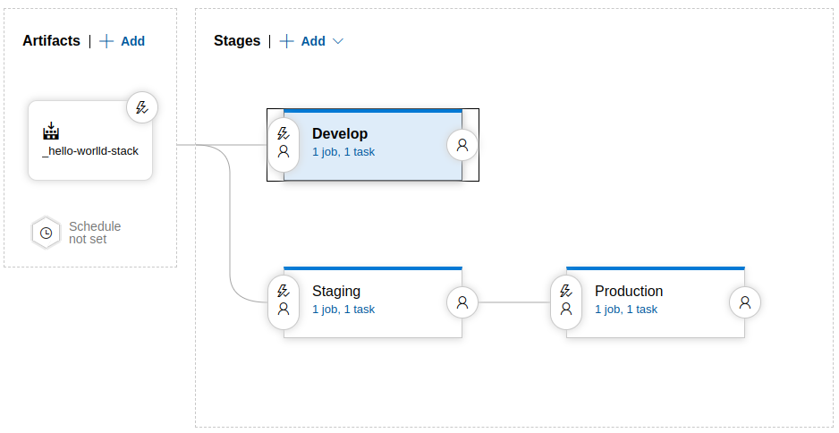

<!-- Improved compatibility of back to top link: See: https://github.com/othneildrew/Best-README-Template/pull/73 -->
<a name="readme-top"></a>
<!--
*** Thanks for checking out the Best-README-Template. If you have a suggestion
*** that would make this better, please fork the repo and create a pull request
*** or simply open an issue with the tag "enhancement".
*** Don't forget to give the project a star!
*** Thanks again! Now go create something AMAZING! :D
-->


<!-- PROJECT SHIELDS -->
<!--
*** I'm using markdown "reference style" links for readability.
*** Reference links are enclosed in brackets [ ] instead of parentheses ( ).
*** See the bottom of this document for the declaration of the reference variables
*** for contributors-url, forks-url, etc. This is an optional, concise syntax you may use.
*** https://www.markdownguide.org/basic-syntax/#reference-style-links
-->
<!-- [![Contributors][contributors-shield]][contributors-url]
[![Forks][forks-shield]][forks-url]
[![Stargazers][stars-shield]][stars-url]
[![Issues][issues-shield]][issues-url]
[![MIT License][license-shield]][license-url]
[![LinkedIn][linkedin-shield]][linkedin-url] -->

# Azure CI/CD for deploying an AWS SAM applcation 

<!-- PROJECT LOGO -->
<!-- <br />
<div align="center">
  <a href="https://github.com/github_username/repo_name">
    
  </a>

<h3 align="center">project_title</h3>

  <p align="center">
    project_description
    <br />
    <a href="https://github.com/github_username/repo_name"><strong>Explore the docs »</strong></a>
    <br />
    <br />
    <a href="https://github.com/github_username/repo_name">View Demo</a>
    ·
    <a href="https://github.com/github_username/repo_name/issues">Report Bug</a>
    ·
    <a href="https://github.com/github_username/repo_name/issues">Request Feature</a>
  </p>
</div> -->


<!-- ABOUT THE PROJECT -->
<!-- ## About The Project

[![Product Name Screen Shot][product-screenshot]](https://example.com)

Here's a blank template to get started: To avoid retyping too much info. Do a search and replace with your text editor for the following: `github_username`, `repo_name`, `twitter_handle`, `linkedin_username`, `email_client`, `email`, `project_title`, `project_description`

<p align="right">(<a href="#readme-top">back to top</a>)</p> -->


<!-- ### Built With

* [![Next][Next.js]][Next-url]
* [![React][React.js]][React-url]
* [![Vue][Vue.js]][Vue-url]
* [![Angular][Angular.io]][Angular-url]
* [![Svelte][Svelte.dev]][Svelte-url]
* [![Laravel][Laravel.com]][Laravel-url]
* [![Bootstrap][Bootstrap.com]][Bootstrap-url]
* [![JQuery][JQuery.com]][JQuery-url]

<p align="right">(<a href="#readme-top">back to top</a>)</p>
 -->


<!-- GETTING STARTED -->
## Getting Started

This is a guideline on how to setup a simple CI-CD pipeline using Azure DevOps for deploying AWS Cloudformation stacks including Lambda functions on develop/staging/production environments.

  
 
### Prerequisites

* AWS CLI and AWS Sam CLI for build and deployment.
* AWS keys: should be stored in the Azure library as a variable group used for pipelines.
* Azure DevOps account

### Set up the CI/CD pipeline
1. Create an Azure git repository with 2 branches: `main` (default) and `dev`
2. The repository includes SAM configuration files, Lambda function source code and CI pipeline file for Azure Pipeline:
* SAM configuration files
    * **template.yml**: defines what will be included in the Cloudformation stack created. `Global` section includes default config that can be inherited by defined resources. `Resources` section lists out all the resources needed to be created in the stack and their corresponding configuration. `Outputs` section includes output key-value pairs which will be shown when the stack is created for easier access to output resources and their information.

    ```yaml
    AWSTemplateFormatVersion: '2010-09-09'
    Transform: AWS::Serverless-2016-10-31
    Description: >
      hello-world-stack

      Sample SAM Template for hello-world-stack

    # More info about Globals: https://github.com/awslabs/serverless-application-model/blob/master/docs/globals.rst
    Globals:
      Function:
        Timeout: 3
        MemorySize: 128

    Resources:
      HelloWorldFunction:
        Type: AWS::Serverless::Function # More info about Function Resource: https://github.com/awslabs/serverless-application-model/blob/master/versions/2016-10-31.md#awsserverlessfunction
        Properties:
          CodeUri: hello_world/
          Handler: app.lambda_handler
          Runtime: python3.9
          Architectures:
          - x86_64
          Events:
            HelloWorld:
              Type: Api # More info about API Event Source: https://github.com/awslabs/serverless-application-model/blob/master/versions/2016-10-31.md#api
              Properties:
                Path: /hello
                Method: get

    Outputs:
      # ServerlessRestApi is an implicit API created out of Events key under Serverless::Function
      # Find out more about other implicit resources you can reference within SAM
      # https://github.com/awslabs/serverless-application-model/blob/master/docs/internals/generated_resources.rst#api
      HelloWorldApi:
        Description: API Gateway endpoint URL for Prod stage for Hello World function
        Value: !Sub "https://${ServerlessRestApi}.execute-api.${AWS::Region}.amazonaws.com/Prod/hello/"
      HelloWorldFunction:
        Description: Hello World Lambda Function ARN
        Value: !GetAtt HelloWorldFunction.Arn
      HelloWorldFunctionIamRole:
        Description: Implicit IAM Role created for Hello World function
        Value: !GetAtt HelloWorldFunctionRole.Arn

    ```

    * **samconfig.toml**: stores default parameters for SAM commands. It has 3 config-environments: dev, staging, prod. Each environment has its own parameters for some SAM commands such as build, deploy,... Below is an example of parameters used for dev environment:
    ```toml
    version = 0.1
    [default]

    [default.build.parameters]
    use_container = true
    debug = true

    [dev]

    [dev.global.parameters]
    s3_bucket="dev-hello-world-bucket"
    stack_name="dev-hello-world-stack"
    debug = true

    [dev.build]
    [dev.build.parameters]
    use_container = true

    [dev.deploy]
    [dev.deploy.parameters]
    capabilities="CAPABILITY_IAM"
    fail_on_empty_changeset=false
    confirm_changeset=false

    [staging]

    [staging.global.parameters]
    s3_bucket="staging-hello-world-bucket"
    stack_name="staging-hello-world-stack"
    debug = true

    [staging.build]
    [staging.build.parameters]
    use_container = true

    [staging.deploy]
    [staging.deploy.parameters]
    capabilities="CAPABILITY_IAM"
    fail_on_empty_changeset=false
    confirm_changeset=false

    [prod]

    [prod.global.parameters]
    s3_bucket="prod-hello-world-bucket"
    stack_name="prod-hello-world-stack"
    debug = true

    [prod.build]
    [prod.build.parameters]
    use_container = true

    [prod.deploy]
    [prod.deploy.parameters]
    capabilities="CAPABILITY_IAM"
    fail_on_empty_changeset=false
    confirm_changeset=false
    ```

* Azure CI pipeline:
    * **azure-pipelines.yml**: The CI pipeline will be triggered whenever there are changes commited to the remote branches including `main` and `dev`. Branches for triggering and container image must be defined in the pipeline. Steps are building the project using `sam build`, copying files, folders needed for deployment to a folder and publishing that folder as an artifact for release pipelines. This file will be stored in the root of the repository so that the CI pipeline can be created from it.
    ```yaml
    trigger:
    - main
    - dev

    pool:
      vmImage: ubuntu-latest

    steps:
    - script: |
        sam build
        ls .aws-sam/
      displayName: 'Sam build'

    - task: CopyFiles@2
      inputs:
        Contents: |
          *.yaml
          *.toml
        TargetFolder: '$(build.artifactstagingdirectory)'
        CleanTargetFolder: true
        ignoreMakeDirErrors: true
    - task: CopyFiles@2
      inputs:
        SourceFolder: '.aws-sam'
        Contents: '**'
        TargetFolder: '$(build.artifactstagingdirectory)/.aws-sam'
        CleanTargetFolder: true
        ignoreMakeDirErrors: true

    - publish: $(build.artifactstagingdirectory)
      artifact: SamArtifacts
    ```
3. Create Variable groups in `Library`
  * AWS Credentials

    

4. Create a Release pipeline for deployment: Built artifacts from CI runs triggered by `dev` branch will call the `Develop` stage in the release pipeline. If triggered by `main` branch, the `Staging` stage will be deployed and then run the `Production` stage only if it is completed successfully.

    

  * Trigger:
      - In `Artifacts` block, the **Continuous deployment trigger** option must be enabled with **Build branch filers** including `dev` and `main` branch so that it can be triggered whenever a build artifact is created from the pipelines of these branches.
      - In `Develop` and `Staging` stage, their **Pre-deployment conditions** trigger must be **After release** and **artifact filters** must include the `dev` and `main` branch respectively.
      - In `Production` stage, **Pre-deployment conditions** trigger must be **After stage** for `Staging` stage and **artifact filters** must include the `main` branch.
  
  * Environment variables: Link variable groups to their corresponding stage for better management of deployment configuration. The AWS credential variable scope must be `Release`. Different cloudformation stack and s3 bucket is used for each stage. 
    

  * Stage task: The deployment process is similar between 3 stages. The only difference lies in the configuration environment used in that stage (`--config-env` option).
   ```sh
    #!/bin/bash
    echo "Current working dir: ${PWD}"
    echo "AWS ID $(aws sts get-caller-identity --query "Account" --output text)"
    echo "Region: ${AWS_DEFAULT_REGION}"
    echo "Stack-name: ${STACK_NAME}"
    echo "Bucket-name: ${BUCKET_NAME}"
    echo "Use s3api to check if the bucket exists"
    aws s3api head-bucket \
      --bucket "${BUCKET_NAME}" \
      --region "${AWS_DEFAULT_REGION}" \
      &>/dev/null  # Redirect error output to null

    # Check the command status to determine if bucket exists or not
    if [ $? -eq 0 ]; then
      echo "Bucket ${BUCKET_NAME} exists"
    else
      echo "Bucket ${BUCKET_NAME} does not exist"
      aws s3 mb s3://${BUCKET_NAME}
    fi

    # Deploy to develop environment. If our goal is to deploy to staging or production environment, just simply change the `--config-env` to staging or prod.
    sam deploy --config-env dev --stack-name ${STACK_NAME} --s3-bucket ${BUCKET_NAME}
   ```

<!-- <p align="right">(<a href="#readme-top">back to top</a>)</p> -->
## Referenes:
* <a href="https://docs.aws.amazon.com/serverless-application-model/latest/developerguide/serverless-sam-cli-config.html">AWS SAM CLI configuration file</a>
* <a href="https://docs.aws.amazon.com/serverless-application-model/latest/developerguide/sam-specification-template-anatomy.html">AWS SAM template anatomy</a>
* <a href="https://docs.aws.amazon.com/serverless-application-model/latest/developerguide/sam-specification-resources-and-properties.html">AWS SAM resource and property reference</a>
* <a href="https://docs.aws.amazon.com/serverless-application-model/latest/developerguide/serverless-sam-cli-command-reference.html">AWS SAM CLI command reference</a>
* <a href="https://docs.aws.amazon.com/serverless-application-model/latest/developerguide/serverless-sam-cli-config.html">AWS SAM CLI configuration file</a>

<!-- ## Contact

Phan Dai Duong - phandaiduong@gmail.com

Project Link: [https://github.com/github_username/repo_name](https://github.com/github_username/repo_name)

<p align="right">(<a href="#readme-top">back to top</a>)</p> -->


<!-- MARKDOWN LINKS & IMAGES -->
<!-- https://www.markdownguide.org/basic-syntax/#reference-style-links -->
[contributors-shield]: https://img.shields.io/github/contributors/github_username/repo_name.svg?style=for-the-badge
[contributors-url]: https://github.com/github_username/repo_name/graphs/contributors
[forks-shield]: https://img.shields.io/github/forks/github_username/repo_name.svg?style=for-the-badge
[forks-url]: https://github.com/github_username/repo_name/network/members
[stars-shield]: https://img.shields.io/github/stars/github_username/repo_name.svg?style=for-the-badge
[stars-url]: https://github.com/github_username/repo_name/stargazers
[issues-shield]: https://img.shields.io/github/issues/github_username/repo_name.svg?style=for-the-badge
[issues-url]: https://github.com/github_username/repo_name/issues
[license-shield]: https://img.shields.io/github/license/github_username/repo_name.svg?style=for-the-badge
[license-url]: https://github.com/github_username/repo_name/blob/master/LICENSE.txt
[linkedin-shield]: https://img.shields.io/badge/-LinkedIn-black.svg?style=for-the-badge&logo=linkedin&colorB=555
[linkedin-url]: https://linkedin.com/in/linkedin_username
[product-screenshot]: images/screenshot.png
[Next.js]: https://img.shields.io/badge/next.js-000000?style=for-the-badge&logo=nextdotjs&logoColor=white
[Next-url]: https://nextjs.org/
[React.js]: https://img.shields.io/badge/React-20232A?style=for-the-badge&logo=react&logoColor=61DAFB
[React-url]: https://reactjs.org/
[Vue.js]: https://img.shields.io/badge/Vue.js-35495E?style=for-the-badge&logo=vuedotjs&logoColor=4FC08D
[Vue-url]: https://vuejs.org/
[Angular.io]: https://img.shields.io/badge/Angular-DD0031?style=for-the-badge&logo=angular&logoColor=white
[Angular-url]: https://angular.io/
[Svelte.dev]: https://img.shields.io/badge/Svelte-4A4A55?style=for-the-badge&logo=svelte&logoColor=FF3E00
[Svelte-url]: https://svelte.dev/
[Laravel.com]: https://img.shields.io/badge/Laravel-FF2D20?style=for-the-badge&logo=laravel&logoColor=white
[Laravel-url]: https://laravel.com
[Bootstrap.com]: https://img.shields.io/badge/Bootstrap-563D7C?style=for-the-badge&logo=bootstrap&logoColor=white
[Bootstrap-url]: https://getbootstrap.com
[JQuery.com]: https://img.shields.io/badge/jQuery-0769AD?style=for-the-badge&logo=jquery&logoColor=white
[JQuery-url]: https://jquery.com 
